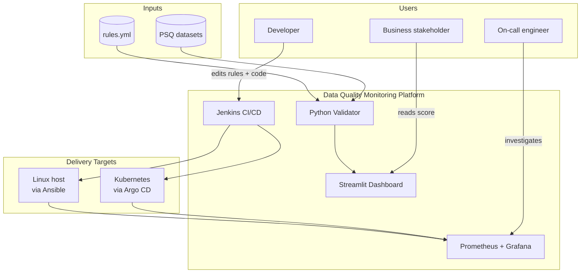
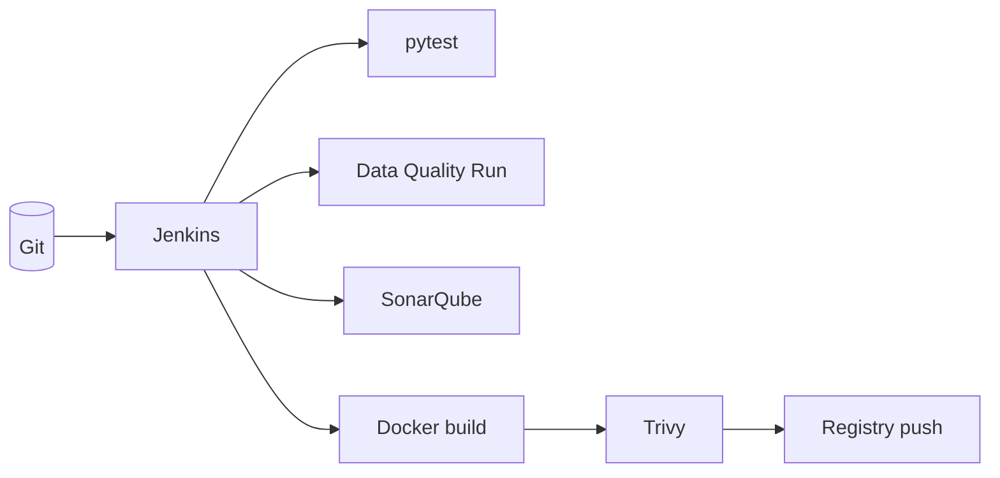
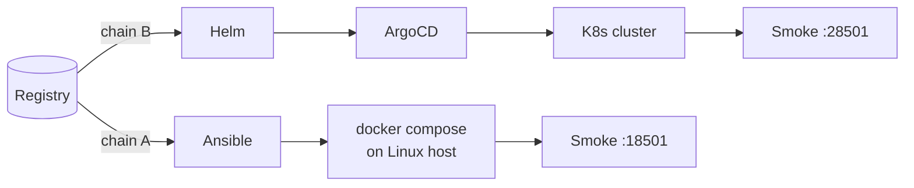
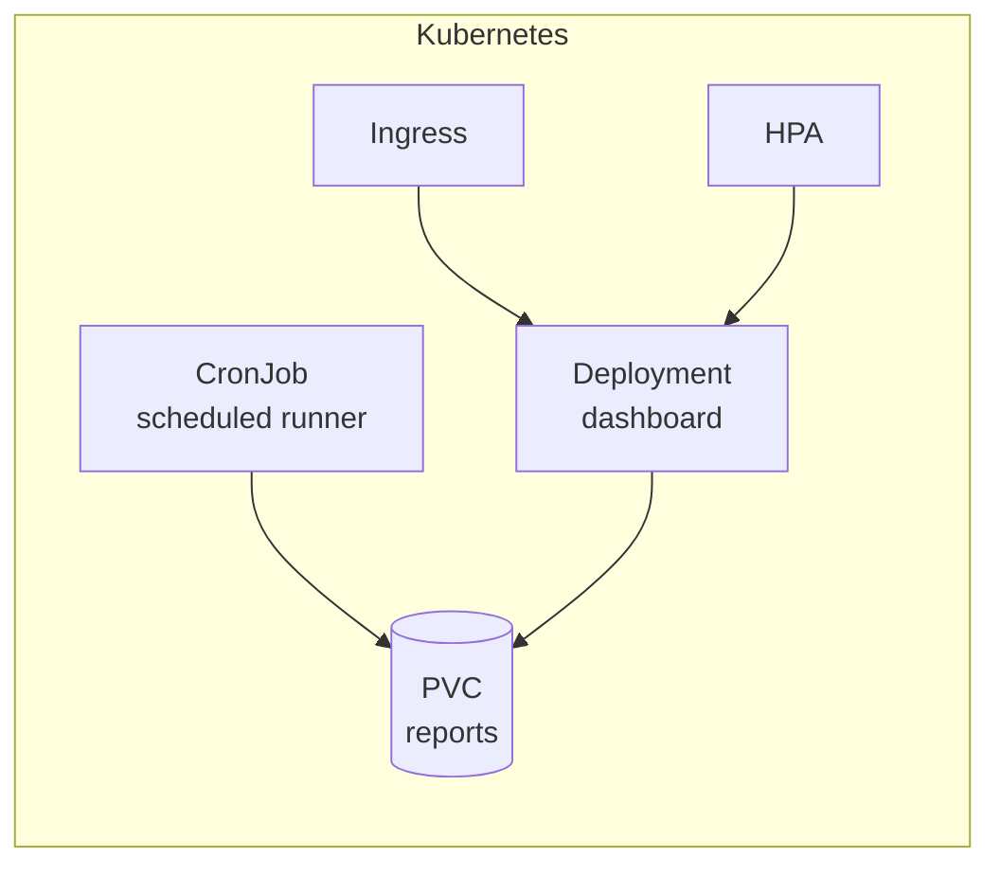
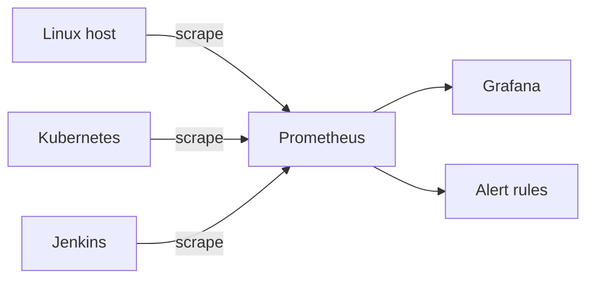
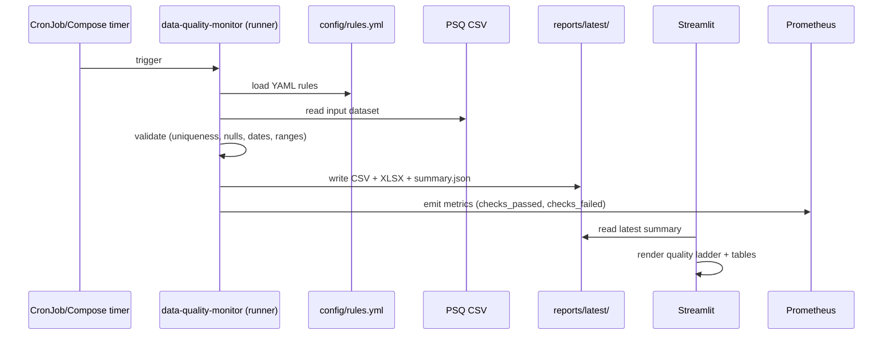

# Architecture

A reference for what this platform is, how its pieces fit together, and why the design decisions were made the way they were.

For step-by-step pipeline details, see [backend-delivery-chains.md](backend-delivery-chains.md). For day-2 ops, see [runbook.md](runbook.md). For the spoken walkthrough, see [interview-script.md](interview-script.md).

---

## System context

Three distinct audiences, three distinct views:

| Audience | Primary surface | What they care about |
|---|---|---|
| Developer | Jenkins, Git, code | "Does my change pass tests + data quality + security?" |
| Business stakeholder | Streamlit dashboard | "Is our data getting better or worse?" |
| On-call engineer | Grafana, runbook | "Is the platform healthy? What broke?" |

---

## Component breakdown

### Build plane

Jenkins is the single orchestrator. Every stage is independently parameterized so a developer can toggle "tests only," "scan only," or "full pipeline." The image artifact is produced **once** and reused by both delivery chains.

### Delivery plane

Two chains, one artifact. See [backend-delivery-chains.md](backend-delivery-chains.md) for the full breakdown.

### Runtime plane

The Kubernetes side runs:

- a `CronJob` for scheduled data quality validation
- a `Deployment` for the Streamlit dashboard
- a `PersistentVolumeClaim` for generated reports (shared read/write between CronJob and Deployment)
- an `Ingress` for dashboard access
- a `HorizontalPodAutoscaler` for the dashboard

The Linux side runs the same Docker image under Docker Compose, with two services (runner + dashboard) and a bind-mounted reports directory.

### Observability plane

Prometheus scrapes both delivery surfaces and Jenkins. Grafana renders the operations dashboard. Alert rules in `monitoring/prometheus/alerts/` fire on pod unavailability, repeated CronJob failures, and pod restart storms.

---

## Data flow — one validation run

Every run is idempotent in the sense that re-running on the same input produces the same outputs. The `reports/latest/` directory is overwritten; historical runs are kept under `reports/<timestamp>/` when invoked by CI.

---

## Design decisions and trade-offs

### One image for runner and dashboard
Decided to ship a single Docker image with both entry points selected by `command:` in Compose / `args:` in Helm. Trade-off: image is slightly larger than two narrow images, but Trivy only scans one artifact, registry only stores one tag, and there's no version skew possible between runner and dashboard.

### Both Ansible and Helm
Could have done Kubernetes-only. Kept Ansible because **payments and fintech estates are mixed** — VM and Kubernetes side-by-side is the norm for years during a migration. Demonstrating both proves portability of the artifact and the platform engineer's range.

### Argo CD instead of Jenkins `kubectl apply`
Decided to deliver Kubernetes via GitOps even though Jenkins is already authenticated to the cluster. Reasons:
- Single source of truth (Git) for what's deployed
- Rollback is `git revert` — auditable and reviewable
- Drift detection comes for free
- Separation: Jenkins builds; Argo CD deploys

### Trivy and SonarQube as enforcing gates
The demo runs with both gates **enforcing**: SonarQube's quality gate blocks on `qualitygate.wait=true` and Trivy fails the build on any HIGH/CRITICAL vulnerability. A single `.trivyignore` entry covers the upstream-unfixed `ncurses` CVE with a documented rationale. Builds turn red on real findings rather than being green-by-construction.

### YAML-declared rules
Rules live in `config/rules.yml`, not Python code. Adding a new rule for a new column is a config-only change. Cost: rule expressivity is limited to what the validator implements (no arbitrary Python predicates).

### Streamlit for the dashboard
Picked for speed to a working portfolio piece. In production we'd front this with a proper BI tool (Looker, Metabase) reading the report files, or expose metrics directly to Grafana.

---

## Environments

| Environment | Helm values | Argo CD app | Notes |
|---|---|---|---|
| dev | `values-dev.yaml` | `argocd/applications/dev.yaml` | Single replica, no HPA, every 30 min |
| staging | `values-staging.yaml` | `argocd/applications/staging.yaml` | HPA 1–2 replicas |
| prod | `values-prod.yaml` | `argocd/applications/prod.yaml` | HPA 2–5 replicas, every 15 min |
| kind-local | `values-kind-local.yaml` | — | For local kind cluster |
| kind-full | `values-kind-full.yaml` | — | Full local demo with monitoring stack |

Terraform under `terraform/` bootstraps the namespace and any cluster-scoped resources (e.g., Kyverno policies) separately from application delivery.

---

## Security model

| Layer | Control |
|---|---|
| Code | SonarQube static analysis gate |
| Image | Trivy CVE scan before registry push |
| Cluster | Kyverno policies (under `security/policies/`) for pod security baseline |
| Secrets | `.env` rendered at deploy time by Ansible; Kubernetes Secrets templated by Helm. Production: integrate Vault or sealed-secrets (not in scope here) |
| Network | NetworkPolicy not yet applied — documented as a future enhancement |
| Audit | Every deploy is a Git commit (GitOps) or a Jenkins build record (Ansible) |

---

## Capacity assumptions

The demo is sized for a single laptop. Mental model for a real environment:

| Resource | Local demo | Production-shaped |
|---|---|---|
| Dataset size | ~10k rows | 1M–100M rows |
| Validation runtime | <1 s | 5–60 s |
| Runner schedule | every 15–30 min | every 5–15 min, with on-demand triggers |
| Dashboard replicas | 1 | 2–5 behind HPA |
| Report retention | latest only | 90 days on object storage |
| Prometheus retention | local TSDB | managed Prometheus / Thanos |

When the dataset grows past ~1M rows, the in-memory pandas validator becomes the bottleneck — that's the point to consider Polars, DuckDB, or a Spark backend for the validator core.

---

## Related documents

- [README.md](../README.md) — front door and quick start
- [backend-delivery-chains.md](backend-delivery-chains.md) — both pipeline flows in detail
- [interview-script.md](interview-script.md) — 5-minute walkthrough
- [runbook.md](runbook.md) — day-2 operations
- [rollback.md](rollback.md) — rollback procedures
- [sre-checklist.md](sre-checklist.md) — production-readiness checklist
- [rollout-order.md](rollout-order.md) — recommended learning order
